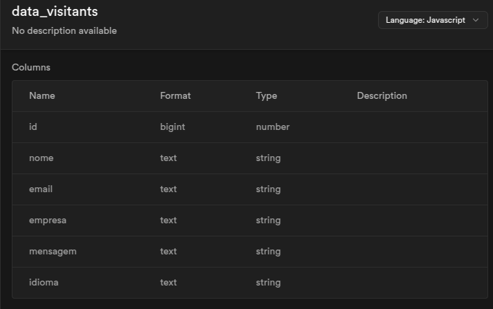

# backend-portfolio

# 📌 Backend API - Envio Automático de Currículo

Este é o backend da aplicação que automatiza o envio do meu currículo por e-mail. A API foi construída com **Node.js** e **Express**, integrando-se ao **Supabase** para armazenamento dos dados dos visitantes e ao **Nodemailer** para envio dos e-mails com o currículo em anexo.

## 🚀 Tecnologias Utilizadas

- **Node.js**: Ambiente de execução JavaScript para o backend.
- **Express**: Framework para construção da API REST.
- **Supabase**: Banco de dados para armazenar os dados dos visitantes.
- **Nodemailer**: Para enviar e-mails automaticamente com o currículo em anexo.
- **dotenv**: Para gerenciar variáveis de ambiente de forma segura.
- **Cors**: Para configurar permissões de acesso entre diferentes origens.

## Documentação de Tabela



## 📂 Estrutura do Projeto

```
📦 meu-portfolio
├── 📂 src
│   ├── 📜 index.tsx     # Ponto de entrada da aplicação
├── 📜 package.json      # Dependências e scripts
├── 📜 tsconfig.json     # Configuração do TypeScript
├── 📜 README.md         # Documentação do projeto
```

## 📦 Como Rodar o Projeto

Para executar o projeto localmente, siga os passos abaixo:

1. Clone este repositório:

   ```sh
   git clone https://github.com/evilyn-cordeiro/backend-portfolio.git
   ```

2. Acesse a pasta do projeto:

   ```sh
   cd meu-portfolio
   ```

3. Instale as dependências:

   ```sh
   npm install
   # ou
   yarn install
   ```

4. Inicie o servidor de desenvolvimento:

   ```sh
   npm run dev
   # ou
   yarn dev
   ```

5. Acesse no navegador:
   ```
   http://localhost:3000
   ```

- Adicione novos projetos na seção correspondente.

## 📌 Contato

Se quiser saber mais sobre mim ou colaborar em projetos, entre em contato:

- **LinkedIn**: [linkedin.com/in/evilyn-profiledev](https://linkedin.com/in/evilyn-profiledev)
- **E-mail**: evilyndeveloper@gmail.com

---

Feito com ❤️ por Evilyn Cordeiro | Software Developer
